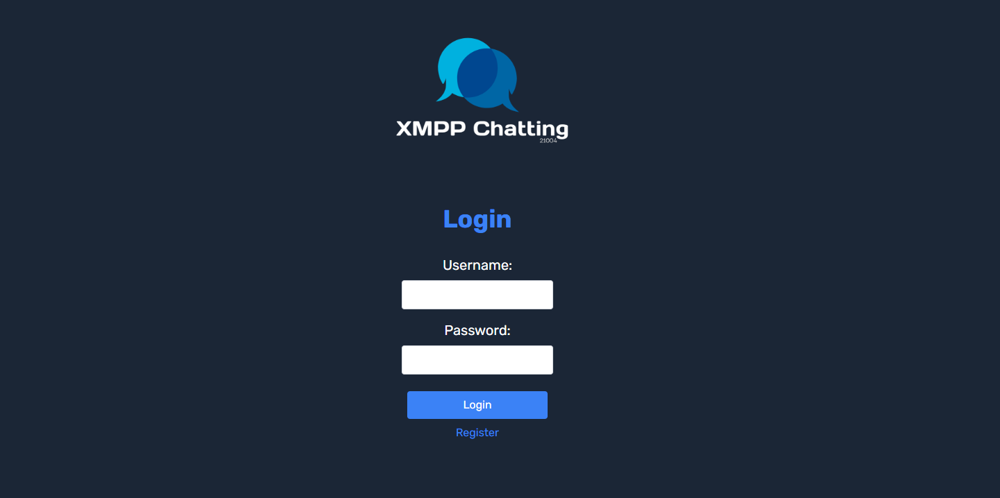
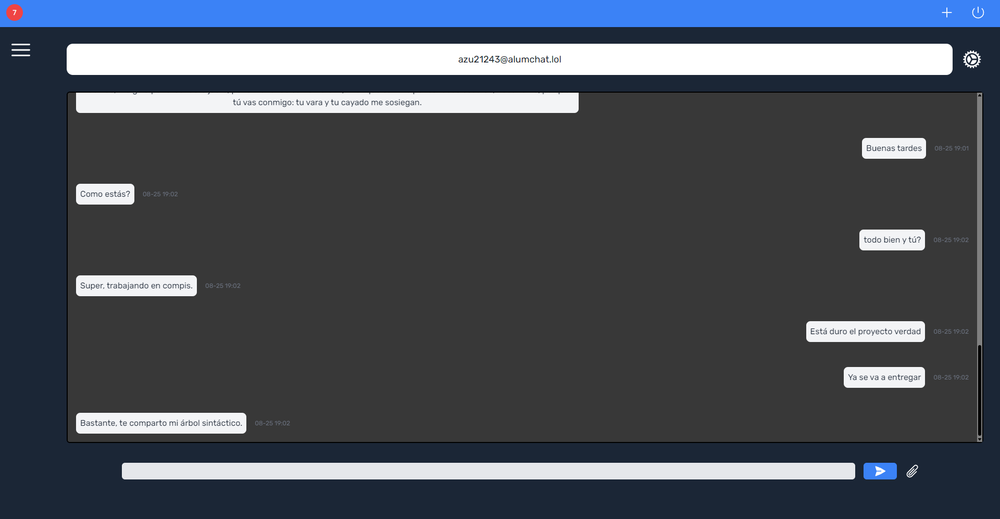
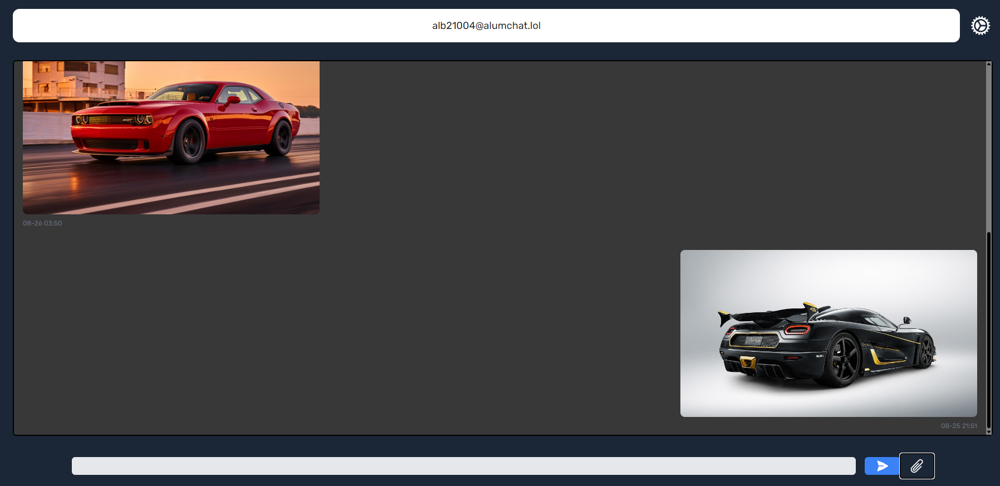
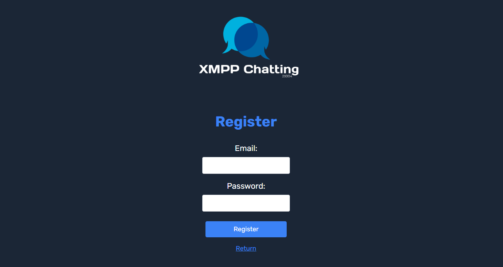
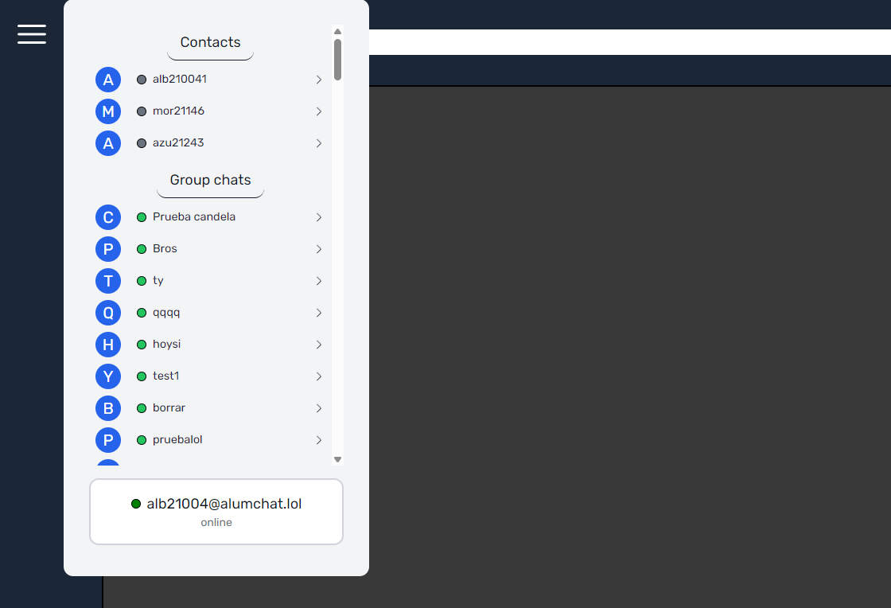
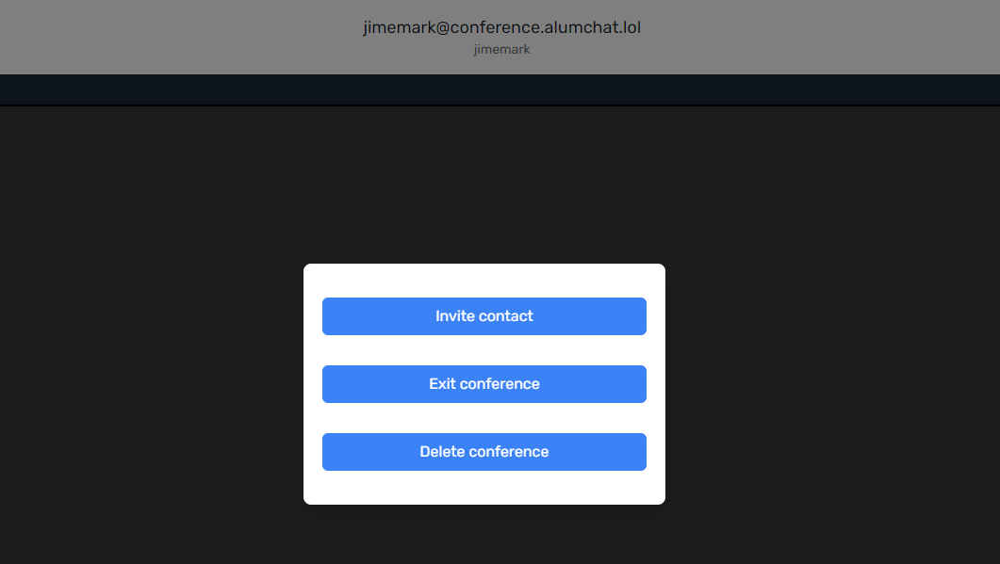
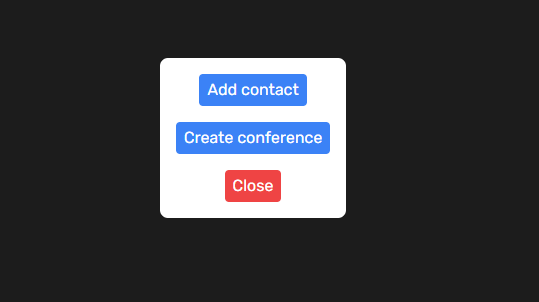
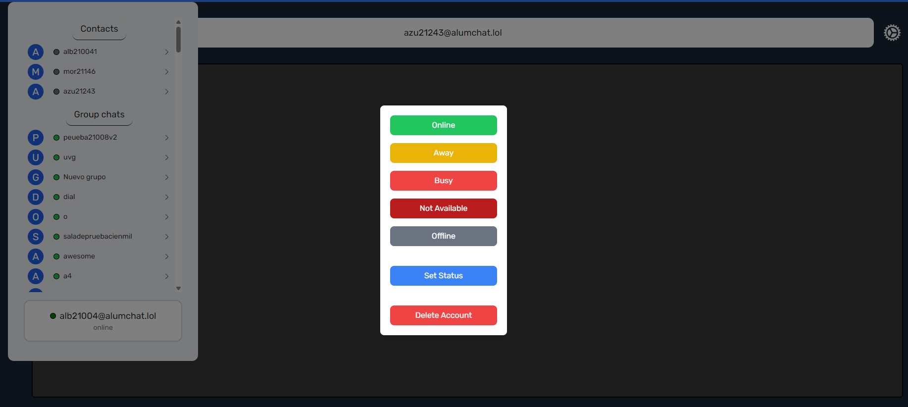

# Project #1: XMPP Chat Client

[](https://github.com/markalbrand56/Redes-Proyecto-1/actions/workflows/wails.yml)

Universidad del Valle de Guatemala



## Author

**Mark Albrand** (21004)

## Table of Contents

- [Project #1: XMPP Chat Client](#project-1-xmpp-chat-client)
  - [Author](#author)
  - [Table of Contents](#table-of-contents)
  - [Project Description](#project-description)
    - [Tech Stack](#tech-stack)
      - [Installation of dependencies](#installation-of-dependencies)
        - [Go](#go)
        - [Wails](#wails)
        - [Node.js](#nodejs)
        - [Tailwind CSS](#tailwind-css)
  - [Functionalities](#functionalities)
    - [Project requirements](#project-requirements)
      - [Account Management](#account-management)
      - [Communication](#communication)
    - [Additional functionalities](#additional-functionalities)
      - [File sharing](#file-sharing)
  - [Project Structure](#project-structure)
  - [How to Run](#how-to-run)
  - [Image Gallery](#image-gallery)
  - [Reflection](#reflection)
    - [Challenges](#challenges)
      - [Developing a chat client in a month](#developing-a-chat-client-in-a-month)
      - [Finding a XMPP library](#finding-a-xmpp-library)
      - [Overcoming Library Limitations](#overcoming-library-limitations)
    - [Lessons Learned](#lessons-learned)
  - [License](#license)

## Project Description

### Tech Stack

- **Frontend**: Vue.js
  - **Styling**: Tailwind CSS
- **Backend**: Go 1.21
- **Linker**: Wails

This project is built using the Wails framework, which allows to build desktop applications using Go and a JavaScript frontend framework. The frontend is built using Vue.js, and the backend is built using Go.

#### Installation of dependencies

To run this project, you need to have the following dependencies installed on your system:

##### Go

To install Go, follow the instructions on the [official website](https://golang.org/doc/install) and download the installer for your operating system. Make sure to get at least **Go 1.21**.

##### Wails

To install Wails, follow the instructions on the [official website](https://wails.io/docs/gettingstarted/installation). In summary, you can install Wails using the following command:

```bash
go install github.com/wailsapp/wails/v2/cmd/wails@latest
```

This command will install the Wails CLI tool, which is used to build and run Wails applications.

##### Node.js

To install Node.js, follow the instructions on the [official website](https://nodejs.org/en/download/). Make sure to get at least **Node.js 14**.

##### Tailwind CSS

Tailwind does not require a global installation, but you can install it as a development dependency on the frontend project. To do so, run the following commands:

```bash
npm install -D tailwindcss postcss autoprefixer
npx tailwindcss init -p
```

## Functionalities

This project aims to build a chat client using the XMPP protocol. Its requirements were defined by the course instructor, and additional functionalities were added to the project.

This implementation uses the XMPP protocol to communicate with a server, and it uses `gosrc.io/xmpp` library to handle the communication and connection. More information about the library can be found [here](https://pkg.go.dev/gosrc.io/xmpp).

### Project requirements

This project had to be built around the server given for this project, which is a custom server built by the course instructors. This means that this project will not be fully functional with other XMPP servers, as it uses custom implementations for some functionalities.

> **Note**: One of this functionalities is to be able to create an account. This was a challenge with the server provided, as it did not allow anonymous connections. This is why for this functionality this project has to connect to a pre-existing account in order to create a new account.

#### Account Management

- [x] Register a new account
- [x] Login with an existing account
- [x] Logout from the account
- [x] Delete the account

#### Communication

- [x] Show the list of contacts, and their status
- [x] Add a new contact
- [x] Show details of a contact
- [x] Send a message to a contact (one-to-one chat)
- [x] Participate in a group chat
- [x] Define a status and a status message
- [x] Send/receive notifications
- [x] Send/receive files

### Additional functionalities

- [x] Get archive of messages
- [x] Delete group chat
- [x] Invite a contact to a existing private group chat
- [x] Delete a contact from the contact list
- [x] Persistent user status and status message

#### File sharing

As the given server did not support XMPP's extensions for file sharing, instead of sending files through the XMPP server as a base64 encoded string, it was developed a simple [File Server](https://github.com/markalbrand56/XMPP-File-Server) which allows to upload and access files through a REST API. This server is built using Go and uploads files to a `AWS S3 bucket`.

This file server was shared with a close group of friends, and it is not intended to be used by the public. This allowed us to have a simple file sharing system and file preview system in our projects.

## Project Structure

The project is structured as follows, the project itself is contained in the `cmd` directory. This directory contains the backend application, which is built using Go, and the frontend application, which is built using Vue.js.

```bash
├── cmd/
│   ├── backend/
│   │   ├── models/            # Models for the backend application
│   │   │    └── stanza/           # Structs to represent XMPP stanzas not covered by the library
│   │   └── chat/
│   │       ├── chat.go            # Core chat event handling functions
│   │       ├── handlers.go        # Event handlers for various chat operations
│   │       ├── register.go        # Functions to register events
│   │       └── events/            # Event definitions for the chat application
│   │
│   ├── frontend/
│   │   ├── index.html         # HTML template for the frontend
│   │   ├── wails/             # Wails files for linking the frontend and backend
│   │   ├── dist/              # Distribution folder for the frontend build
│   │   ├── src/               # Source code for the frontend
│   │   │   ├── assets/            # Static assets like images and fonts
│   │   │   ├── components/        # Vue components used across the application
│   │   │   ├── pages/             # Vue components representing pages/views
│   │   │   ├── App.vue            # Root Vue component
│   │   │   ├── main.js            # Entry point for the frontend application
│   │   │   ├── router.js          # Vue Router setup for page navigation
│   │   │   └── style.css          # Global CSS styles
│   │   ├── package.json               # Node.js package file
│   │   ├── tailwind.config.js         # Tailwind CSS configuration file
│   │   └── vite.config.js             # Vite configuration file
│   │
│   ├── wails.json                 # Wails configuration file
│   ├── app.go                     # Entry point for the Go backend application
│   ├── go.mod                     # Go module file
│   ├── go.sum                     # Go dependencies checksum file
│   └── main.go                    # Main Go application logic
│
├── .gitignore                 # Git ignore file
├─  README.md                  # Project README file 
└── LICENSE                    # Project license file


```

## How to Run

This project provides binaries for Windows, MacOS and Linux in the release section on GitHub. For Windows, it also provides a NSIS installer to install the application.

Additionally, you can run the project from source code. To do so, you need to have the dependencies listed on the [tech stack](#tech-stack) section.

Wails handles the building and running of the project, including the frontend and backend. So, to run the project from source code, follow these steps:

1. Clone the repository
2. Navigate to the project directory
3. Enter to the `cmd` directory
4. To run on development mode, run the following command:

```bash
wails dev
```

5. To build the project, run the following command:

```bash
wails build
```

6. The binaries will be available in the `build` directory

> As stated before on the [project functionalities](#functionalities) section, this project was built around a custom server. If you want to use a different server, you will need to modify the `address` variable on the `chat.go` file over on the `cmd/backend/chat` directory. 

## Image Gallery















## Reflection

### Challenges

#### Developing a chat client in a month

One of the main challenges of this project was the deadline. We were required to develop this project in a month, with a full-fledged frontend and backend. This was a challenge, as it required us to learn new technologies, frameworks and the XMPP protocol in a short amount of time. As a student, this also meant that we had to balance this project with other courses and responsibilities, in a semester full of projects. Adittionally, as a backend developer, I don't have much experience with frontend development, which made this project even more challenging, specially because it was an individual project.

For this reason, the approach taken was to choose a language were I felt comfortable with, and to choose a framework that would allow me to build the project quickly. This is why I chose Go. As a backend developer, Go is currently my favorite language, and I have profesional experience building applications with it. Additionally, I chose to learn Wails, as it seemed like a good framework to build desktop applications with Go. For the frontend, I chose Vue.js, as I have little professional experience with frontend development, and I wanted a framework that would allow me to build the frontend quickly and with less boilerplate than React. This project was the second time I used Vue.js, and I felt comfortable with it.

#### Finding a XMPP library

Another challenge was to find a good XMPP library. The first week of the project was spent researching XMPP libraries for different languages, and trying to find a library that would allow me to build the project quickly. Technical issues with the server delayed this process, as I had to wait for the server to be fixed in order to test the libraries. For example, the server did not allow connections over WebSockets, nor did it have any security certificates, which made it difficult to test most libraries. Additionally, the server did not support some XMPP extensions, which made it difficult to test some functionalities. Most notably, Python's `slixmpp` library had trouble connecting to the server.

When the server finally allowed connections over WebSockets, I was able to test the `gosrc.io/xmpp` library, which worked well with the server. Over the second week of the project, I focused on learning the library and building the chat client's backend.

#### Overcoming Library Limitations

The library `gosrc.io/xmpp` was chosen because it was one of the few XMPP libraries for Go with a solid documentation and examples. However, this library was not build around the different actions a XMPP server has. What I mean is that this library is very well built to handle incoming and outgoing transactions/stanzas, but the only methods it provides is `Send()` and `SendIQ()`. It also provided some basic stanzas, but this ment that most of the work revolved around building the stanzas and handling their responses.

For example, this is what the function to create a new stanza to request the archive for the active user looks like:

```go

func NewArchiveQuery(jid string, max int) Archive {
    return Archive{
        XMLName: xml.Name{Space: "urn:xmpp:mam:2", Local: "query"},
        Type:    "set",
        ID:      "mam_query_1",
        Query: Query{
            XMLName: xml.Name{Local: "query"},
            X: X{
                XMLName: xml.Name{Local: "x"},
                XMLNS:   "jabber:x:data",
                Type:    "submit",
                Field: []Field{
                    {
                        XMLName: xml.Name{Local: "field"},
                        Var:     "FORM_TYPE",
                        Type:    "hidden",
                        Value:   "urn:xmpp:mam:2",
                    },
                    {
                        XMLName: xml.Name{Local: "field"},
                        Var:     "with",
                        Value:   jid,
                    },
                },
            },
            Set: Set{
                XMLName: xml.Name{Local: "set"},
                XMLNS:   "http://jabber.org/protocol/rsm",
                Max: Max{
                    XMLName: xml.Name{Local: "max"},
                    Value:   fmt.Sprintf("%d", max),
                },
            },
        },
    }
}
```

All of the structs used were built by me, as the library did not provide them. This function builds a new `Archive` stanza to request the archive for the active user. This is a simple example, but it shows how most of the work was to build the stanzas and handle their responses.

This was a challenge, as it required me to learn the XMPP protocol and the server's implementation of it. The solution was to carefully read the library's documentation and examples, and to my surprise, the library was very well documented and had a lot of examples. The most useful was precisely an exmple of [how to build a custom stanza](https://github.com/FluuxIO/go-xmpp/tree/master/_examples/custom_stanza). This example was very useful to understand how to build a custom stanza and how to handle its response.

On the other hand, this approach of developing the project allowed me to have more control over the application, and to build the application in a way that was more tailored to the server's implementation. Additionally, this framework did help a lot in the handling of the application's events as a whole. Its good management of `goroutines` and `channels` allowed me to build a solid event handling system.

### Lessons Learned

This project was a great learning experience. I learned a lot about the XMPP protocol, the Wails framework, and the Vue.js framework. I also had the opportunity to learn more about Go, and to build a desktop application with it. This project was a great opportunity to learn new technologies and to build a full-fledged application in a short amount of time.

Learning a complex protocol like XMPP was a challenge, but it was also very rewarding. I learned a lot about how chat clients work, and how to build a chat client from scratch. I also learned a lot about the different features of the XMPP protocol, and how to implement them in a chat client. This project was a great opportunity to learn more about networking, and to build a real-world application that uses a complex protocol.

## License

This project is licensed under the GNU General Public License v3.0 - see the [LICENSE](LICENSE) file for details.
